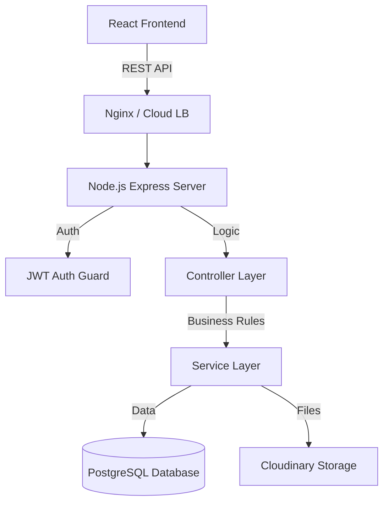

# PropAnalyze Backend – Master Handover Document

> **Status**: Handover Ready  
> **Version**: 1.0.0  
> **Last Updated**: 2026-02-05  

This document serves as the **Single Source of Truth** for the PropAnalyze Backend. It is designed to allow any developer to understand, run, and extend the system without requiring prior context.

---

## 1. Product Overview

### **Product Purpose**
PropAnalyze is a **Real Estate Investment Analysis Platform** that empowers investors and agents to find, underwrite, and report on rental properties. It automates financial modeling (ROI, Cap Rate) and provides geospatial intelligence.

### **Main Features**
- **Property Listing & Search**: Advanced filtering by price, metrics, and geolocation.
- **Investment Analysis**: Real-time calculation of Cash-on-Cash Return, NOI, and Max Allowable Offer.
- **Geospatial Intelligence**: Radius-based search (e.g., "Properties within 50 miles of NYC").
- **Portfolio Management**: Grouping properties into portfolios for aggregate tracking.
- **Reporting Engine**: Automated PDF generation for investment summaries (Pro Feature).

### **User Roles**
| Role | Permissions |
| :--- | :--- |
| **User** | Can search properties, run analyses, save portfolios. |
| **Agent** | Can upload/manage their own property listings. |
| **Admin** | Full system access (manage all users, properties, system settings). |

### **Supported Platforms**
- **Web**: Primary React Application.
- **Mobile**: Responsive web design (no native app currently).

---

## 2. Architecture Overview

### **System Architecture**
The backend follows a **Layered Monolithic Architecture** using Node.js and Express.



### **Tech Stack**
- **Runtime**: Node.js v18+
- **Framework**: Express.js (v4.x)
- **Database**: PostgreSQL (v14+)
- **ORM/Driver**: `pg` (Raw SQL for performance/control)
- **Authentication**: JWT (JSON Web Tokens)
- **File Storage**: Cloudinary (Images & PDFs)
- **PDF Engine**: `html-pdf-node`

### **Third-Party Integrations**
- **Cloudinary**: Image and PDF storage.
- **Mapbox/Google Maps** (Frontend only, Backend stores coordinates).

---

## 3. Environment Information

### **API Base URLs**
| Environment | Base URL | Status |
| :--- | :--- | :--- |
| **Development** | `http://localhost:5000/api/v1` | Active |
| **Staging** | `https://staging-api.propanalyze.com/api/v1` | TBD |
| **Production** | `https://api.propanalyze.com/api/v1` | TBD |

### **Required Headers**
All protected endpoints require:
```http
Content-Type: application/json
Authorization: Bearer <your_jwt_token>
```

### **CORS Configuration**
- Currently set to allow **ALL** origins (`cors()`) for development.
- **Production TODO**: Restrict specific domains in `app.js`.

---

## 4. Authentication & Authorization

### **Auth Strategy**
- **Type**: JWT (Stateless)
- **Token Expiry**: 90 Days (Configurable in `.env`)
- **Refresh Token**: Not currently implemented (Long-lived access tokens used).

### **Endpoints**
- **Login**: `POST /users/login` -> Returns `{ token, user }`
- **Signup**: `POST /users/signup` -> Returns `{ token, user }`
- **Profile**: `GET /users/me` -> Returns User Profile

### **Permission Matrix**
| Action | User | Agent | Admin |
| :--- | :---: | :---: | :---: |
| View Properties | ✅ | ✅ | ✅ |
| Run Analysis | ✅ | ✅ | ✅ |
| Create Property | ❌ | ✅ | ✅ |
| Edit Own Property | ❌ | ✅ | ✅ |
| Delete Any Property | ❌ | ❌ | ✅ |
| Generate PDFs | ✅ | ✅ | ✅ |
| Manage Users | ❌ | ❌ | ✅ |

---

## 5. API Documentation

We provide complete documentation via Swagger/OpenAPI.

- **Swagger UI**: `http://localhost:5000/api-docs` (Run server to view)
- **Postman Collection**: [Download Link / File in Repo]

### Key Resource Overview
> **Note**: This is a summary. Refer to Swagger for full details.

#### **Properties**
| Method | Endpoint | Description |
| :--- | :--- | :--- |
| `GET` | `/properties` | List properties (supports filtering/sorting) |
| `GET` | `/properties/:id` | Get property details |
| `POST` | `/properties` | Create property (Agent only) |
| `PATCH` | `/properties/:id` | Update property |

#### **Analysis**
| Method | Endpoint | Description |
| :--- | :--- | :--- |
| `GET` | `/analysis/roi/:propertyId` | Calculate ROI/Cap Rate |
| `GET` | `/analysis/max-offer/:propertyId` | Calculate max offer price for target return |

#### **Reports**
| Method | Endpoint | Description |
| :--- | :--- | :--- |
| `POST` | `/reports/generate` | Generate PDF report for a property |

---

## 6. API Naming & Conventions

- **URL Paths**: `kebab-case` and plural (e.g., `/properties`, `/max-offer`).
- **JSON Response**: `camelCase` (e.g., `maxAllowableOffer`).
- **Database Columns**: `snake_case` (e.g., `created_at`, `agent_id`).
- **Dates**: ISO 8601 Strings (`2023-10-27T10:00:00Z`).
- **Nulls**: Null fields are returned as `null`, not omitted.

---

## 7. Sample API Requests & Responses

### **Sample Error Response**
```json
{
  "status": "fail",
  "message": "Duplicate field value: email. Please use another value!",
  "error": { ...stack trace in dev... }
}
```

### **Sample Success Response (Analysis)**
```json
{
  "status": "success",
  "data": {
    "metrics": {
      "noi": 24000,
      "capRate": 6.8,
      "cashOnCash": 9.2,
      "monthlyCashFlow": 450
    }
  }
}
```

---

## 8. Data Models / Database Schema

### **1. Users Table**
- **id**: UUID (PK)
- **email**: VARCHAR (Unique)
- **role**: ENUM ('user', 'agent', 'admin')
- **favorites**: JSONB (Array of Property IDs)

### **2. Properties Table**
- **id**: UUID (PK)
- **agent_id**: UUID (FK -> Users)
- **location**: JSONB (`{ "address": "...", "coordinates": [lat, lng] }`)
- **features**: JSONB (amenities, etc.)

### **3. Analyses Table**
- Stores saved calculation snapshots per user/property.

### **4. Reports Table**
- Tracks generated PDF URLs and link to Cloudinary.

*(See `src/db/schema.sql` or `setup_db.js` for exact DDL)*

---

## 9. Pagination, Filtering & Sorting

### **Pagination**
- **Method**: `page` and `limit` query parameters.
- **Defaults**: `page=1`, `limit=20`.
- **Response**: Includes `total`, `page`, `totalPages`.

### **Filtering**
- **Exact Match**: `?category=Residential`
- **Range**: `?price[gte]=100000&price[lte]=500000`
- **Geo**: `/properties-within/50/center/34.05,-118.25/unit/mi`

### **Sorting**
- **Param**: `sort`
- **Values**: `price`, `-price` (desc), `newest`, `oldest`.

---

## 10. File Uploads

- **Endpoint**: `POST /properties` (Multipart/Form-Data)
- **Middleware**: `multer`
- **Storage**: **Cloudinary** (Auto-optimization applied).
- **Max Size**: 5MB per image (configured in Multer).
- **Format**: JPG, PNG.

---

## 11. Error Handling System

All errors follow a standardized JSON format handled by `middlewares/error.middleware.js`.

- **400**: Bad Request (Validation failed).
- **401**: Unauthorized (Invalid/Missing Token).
- **403**: Forbidden (Role mismatch).
- **404**: Not Found.
- **500**: Internal Server Error.

---

## 12. Business Logic Highlights

### **ROI Calculation**
Centralized in `AnalysisService`.
- **NOI** = (Gross Rent - Vacancy - Expenses)
- **Cap Rate** = (NOI / Purchase Price) * 100
- **Cash on Cash** = (Annual Cash Flow / Total Cash Invested) * 100

### **Max Offer Algorithm**
Uses a **Binary Search** approach to find the exact purchase price that yields the user's target CoC% within a 0.01% tolerance.

---

## 13. Security Considerations

- **Rate Limiting**: Limited to 100 requests per hour per IP (`express-rate-limit`).
- **Helmet**: secure HTTP headers (partially disabled for dev content policies).
- **Password Hashing**: `bcryptjs` with salt round 12.
- **SQL Injection**: Prevented via Parameterized Queries (`pg`).

---

## 14. Performance & Limits

- **Rate Limit**: 100 req/hour (Middleware).
- **Pagination Limit**: Max 100 items per page.
- **PDF Generation**: Computationally expensive; async processing recommended for high load (current: synchronous).

---

## 15. Feature Completion Status

| Feature | Status | Notes |
| :--- | :---: | :--- |
| **User Auth** | ✅ | Complete |
| **Property CRUD** | ✅ | Complete |
| **Geo Search** | ✅ | Radius search working |
| **Analysis Engine** | ✅ | ROI/Max Offer working |
| **PDF Reporting** | ✅ | Integrated with Cloudinary |
| **Email Notifications** | ❌ | Planned |
| **Payment Integration** | ❌ | Planned (Stripe) |

---

## 16. Deployment & DevOps

### **Env Variables (Non-Secret)**
`NODE_ENV`, `PORT`.

### **Secrets (Must Set in Prod)**
`DATABASE_URL`, `JWT_SECRET`, `CLOUDINARY_*`.

### **Process**
1.  Check out code.
2.  `npm install --production`.
3.  Run migrations: `node setup_db.js`.
4.  Start: `npm start` (or `pm2 start server.js`).

---

## 17. Handover & Support

**Primary Contact**: Development Team (dev@propanalyze.com)  
**Bug Reporting**: Submit Issue in GitHub Repository.  

### **Client-Friendly Summary**
"PropAnalyze is a digital analyst for real estate. It takes raw property data, combines it with your financial assumptions, and instantly tells you if a deal makes money. It's like having a financial advisor in your pocket for every property you look at."

---

## 📦 Final Delivery Package

This repository contains:
1.  **Source Code**: Full Backend Node.js source.
2.  **API Docs**: Swagger UI at `/api-docs`.
3.  **Database Scripts**: SQL schema for setup.
4.  **This Document**: Your map to the system.

**Next Steps for Team**:
- [ ] Set up Staging Environment.
- [ ] Review `TODO` comments in code.
- [ ] Configure specialized CORS domain list for production.

---
